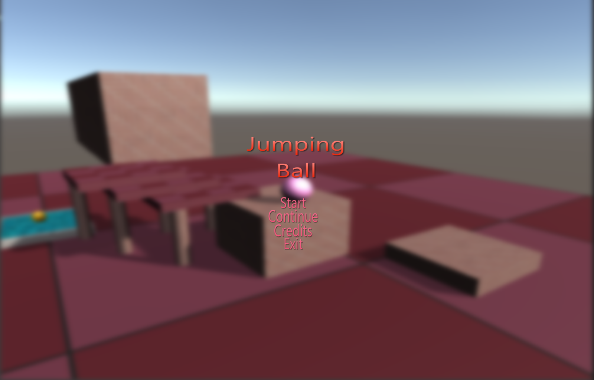
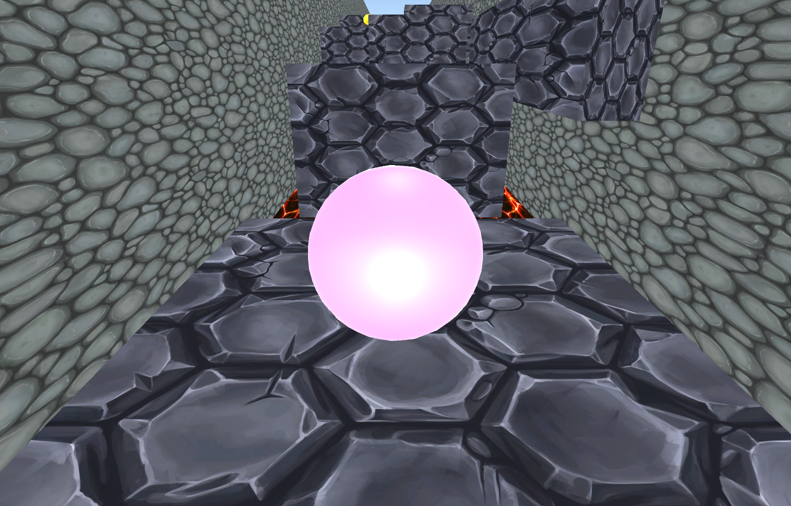

<!-- GAME PROJECT TITLE -->
# Jumping-Ball---Game
Game created for study purposes by Matheus Soares Martins, it is a simple 3d platform game where you can move the character around, and jump.
Has a menu, a pause and save stage system.
It can toggle between fullscreen mode and windowed mode, have invisible objects, moving objects, object destruction and camera perspective switch.
 

This game was made to be player by one player, and have just two levels.
 

Game controls 
- Player controls: 
Arrow Up or W - Goes up 
Arrow Left or A - Goes left 
Arrow Down or S - Goes down 
Arrow Right or D - Goes right 
Space - Jumps the character 

- Other controls: 
Esc - Pauses the game 
F11 - Toggle between fullscreen and windowed mode. 
******************************************************************************

 

# Screnshots
<!-- GAME PROJECT IMAGES -->

<!-- GAME PROJECT BUILDS -->
# Game download
## Windows:  https://mega.nz/folder/lcUXgbAA#ufPsGMt7EVVKbINkdiqe8g
## Mac:  https://mega.nz/folder/pBczwRSB#IArBY3_PoAtWhpdLfVzgjg
## Linux:  https://mega.nz/folder/gB1R0baA#cmKjhmbz-T1Q2Yvn_WfyeA